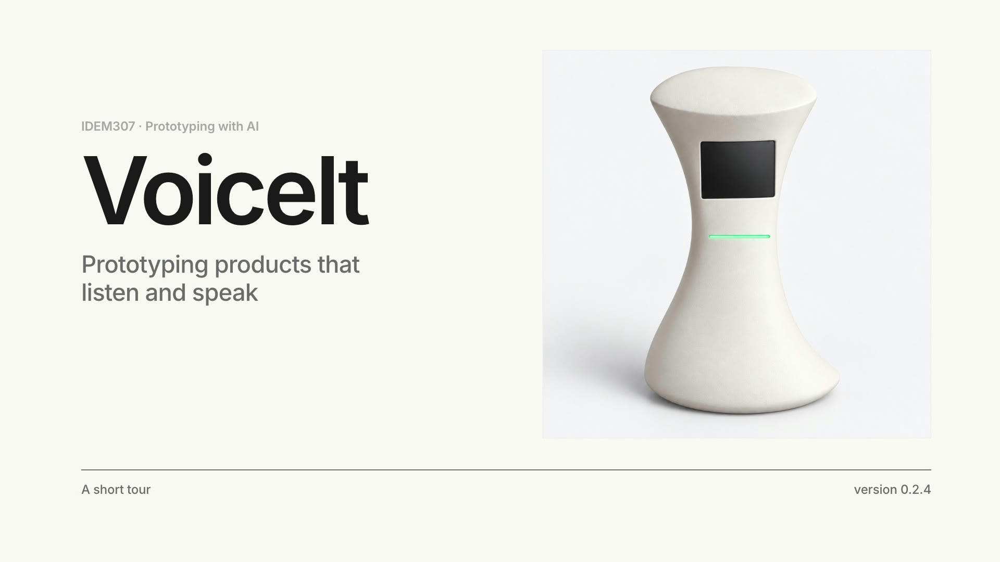
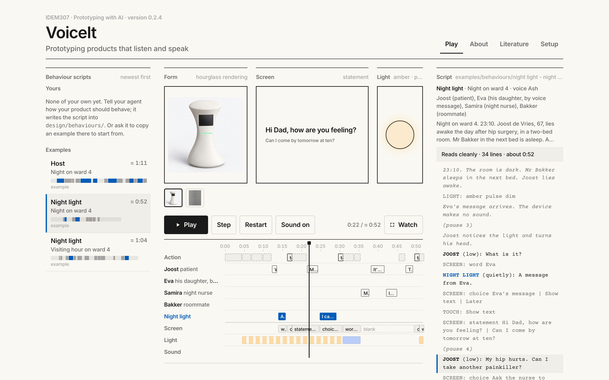
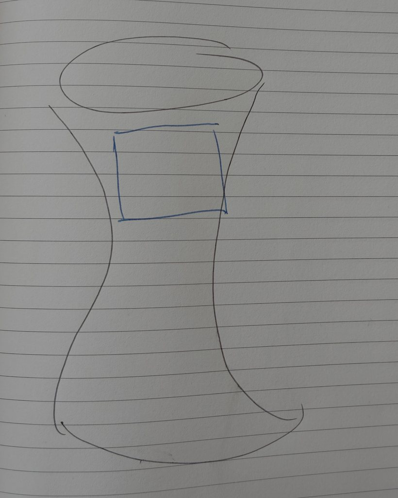
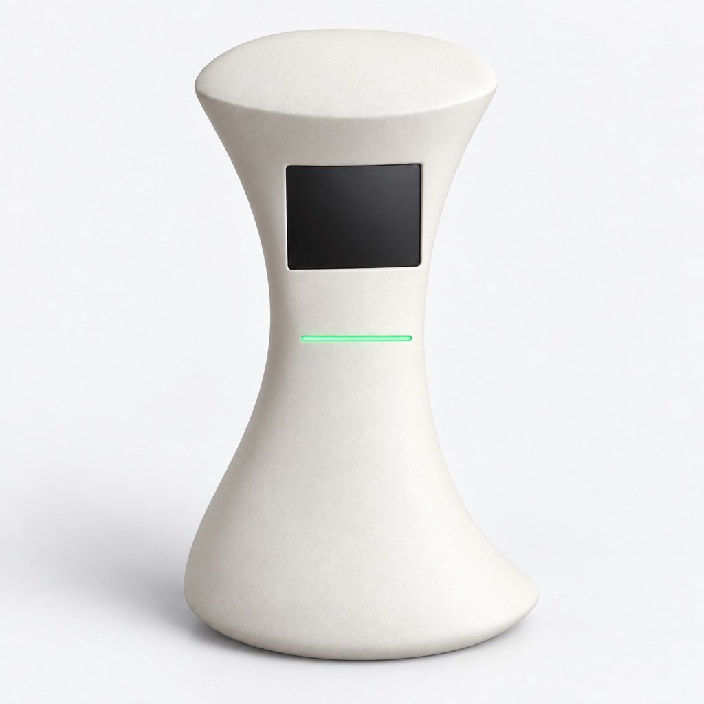

# VoiceIt

VoiceIt is a rapid prototyping tool for exploring how products such as smart speakers and voice assistants interact with people. It lets designers write and play scenarios that demonstrate a product’s proposed behaviour before building a working device. A scenario can include conversations involving several people, accompanied by screen messages, light signals and sound effects.

Designers describe the interaction they want to explore in everyday language, and an AI coding assistant helps turn it into a script that VoiceIt can play in the browser. They can listen to the dialogue, inspect the sequence of events and revise the wording, voices or timing. An image represents the proposed physical design, allowing the same behaviour to be tried with different forms. All interactions are scripted, so designers can explore specific situations without implementing speech recognition or a live conversational system.

With VoiceIt, designers can make early design decisions that are difficult to assess through sketches alone. A smart speaker might offer useful advice but interrupt at the wrong moment, speak too formally or address the wrong person. By playing through these situations, designers can discuss how a product should respond and what role it should take. They can try several alternatives, evaluate the relationship between appearance and behaviour, and refine a concept before investing in hardware and software development.

## Watch the tour

[](https://github.com/kortuem/voiceit/raw/main/media/voiceit-demo.mp4)

A short tour, with sound (click the image to download it, 7 MB): start VoiceIt, pick a script and a form, play it, inspect a moment, edit the script and play it again. The video is also in your copy of the repository, in `media/`, with subtitles (`voiceit-demo.srt`).


*Smart speakers, one of them with a screen. Photo: Y2kcrazyjoker4, [CC BY-SA 4.0](https://creativecommons.org/licenses/by-sa/4.0/), via [Wikimedia Commons](https://commons.wikimedia.org/wiki/File:Google_Home_with_Home_Hub_and_Home_Mini_on_table.jpg).*



*VoiceIt playing the Night light example with the hourglass rendering as its form.*

## The VoiceIt interface

Select a behaviour script from the list and choose a product image for it from the thumbnails below the stage. The stage shows the product's form beside its current screen content and light. Press **Play** to watch and listen to the scenario, or **Watch** to enlarge the stage for presenting and discussing a design.

Use **Pause**, **Step** and **Restart** to examine particular moments. The timeline shows when each person and the product speak, together with screen changes, light signals and sounds. Click the timeline or a line in the script to move to that moment; the script highlights the line being played.

Try a different form with the same behaviour, or play another script to compare approaches. To change the dialogue or actions, ask your AI coding assistant or edit the script file. While VoiceIt is running, saved changes appear in the browser within a few seconds.

## Form, behaviour and character

You design two things: the product's **form**, an image of the product, and its **behaviour**, written as a script. The product's **character** is the impression people form of who the product is when they play a behaviour with a form. You judge the character by playing; a script only gives it a name.

A behaviour script reads like a screenplay. **Script excerpt**, from the example *Night light, night on ward 4*:

```
LIGHT: amber pulse dim
Eva's message arrives. The device makes no sound.
(pause 3)
Joost notices the light and turns his head.
JOOST (low): What is it?
SCREEN: word Eva
DEVICE (quietly): A message from Eva.
SCREEN: choice Eva's message | Show text | Later
TOUCH: Show text
```

Plain lines say what happens. A name in capitals speaks, with its manner in brackets; `DEVICE` is the product. `LIGHT`, `SCREEN` and `SOUND` are the product's light signals, screen content and sound effects; `TOUCH` is someone tapping the screen; `(pause 3)` is three seconds of silence. A complete script also starts with a few facts: the character's name, its voice and the people present. The notation is in [system/SCREENPLAY.md](system/SCREENPLAY.md); the available screen components, lights, sounds and voices are in [system/VOCABULARY.md](system/VOCABULARY.md).

A form is an image of the product: a drawing or a rendered image, as PNG, JPG, WebP or SVG. A rough drawing can be enough to judge an interaction. [system/FORM.md](system/FORM.md) describes a way to develop one from a paper sketch with an image-generation tool.

## Try the examples

You need [Git](https://git-scm.com/downloads), [Node.js](https://nodejs.org) 18 or newer, and a browser. In a terminal:

```
git clone https://github.com/kortuem/voiceit.git
cd voiceit
node system/bin/preview
```

Your browser opens VoiceIt. Select an example in the list, choose a form below the stage, and press **Play**. `Ctrl+C` in the terminal stops VoiceIt. Without Node, the examples also play in [VoiceIt online](https://kortuem.github.io/voiceit/).

**Behaviour scripts**, in [examples/behaviours/](examples/behaviours/):

| File | Character | Scene |
| --- | --- | --- |
| `host - night on ward 4.md` | **Host**: talkative and helpful; says everything aloud | Night on ward 4: Joost lies awake after hip surgery, a message from his daughter arrives, and he wants to know whether he may take more pain relief. |
| `night light - night on ward 4.md` | **Night light**: few words, spoken quietly; works through its light and screen | The same night, the same people and events. |
| `night light - visiting hour.md` | **Night light** | Visiting hour on ward 4: the same character in another scene. |

Play the first two one after another to hear two characters in the same scene; play the second and third to see whether one character stays the same in two scenes.

**Forms**, in [examples/forms/](examples/forms/): a hand sketch of an hourglass-shaped speaker, and a rendering made from that sketch with an image-generation tool. Either can serve as a form.

 

## Design your own

To write your own behaviour scripts you also need an AI coding assistant: the **Claude desktop app** (its **Code** tab) or **Codex**. It writes and revises the scripts in the `voiceit` folder with you and checks them. For product images, an image-generation tool such as ChatGPT or Gemini helps turn sketches into renders.

The [tutorial](TUTORIAL.md) takes you through one design session: setting up the assistant, playing an example, inspecting a conversation, writing a behaviour, revising it and adding a product image.

## Voices and timing

- Voices come from your browser and operating system, so they sound different on every laptop; durations (≈) are estimates. For much better voices, download Premium or Enhanced voices on a Mac, or use Edge on Windows: see step 7 of the [tutorial](TUTORIAL.md#1-set-up).
- Browsers: tested in Chrome on macOS. Not yet tested: Edge, Safari, Firefox, and anything on Windows.

## Documentation

- [TUTORIAL.md](TUTORIAL.md): one design session, step by step, and a reference.
- [BRIEF.md](BRIEF.md): the current assignment.
- [system/SCREENPLAY.md](system/SCREENPLAY.md): the script notation and the checks.
- [system/VOCABULARY.md](system/VOCABULARY.md): screen components, lights, sounds, voices and manner.
- [system/FORM.md](system/FORM.md): from sketch to rendered form.
- [system/BOUNDARIES.md](system/BOUNDARIES.md): the limits for the stereotype exercise and beyond.
- [CHANGELOG.md](CHANGELOG.md): what changed from version to version.

## Folders

- [design/](design/) is yours: forms, behaviour scripts and notes.
- [examples/](examples/) holds the example scripts and forms. Leave them as they are; to start from one, copy it into `design/`.
- [media/](media/) holds the video tour.
- [system/](system/) is the tool: notation, vocabulary, procedures for the AI coding assistant, and VoiceIt itself.

**No Node, or it will not start?** Use **VoiceIt online**, [kortuem.github.io/voiceit](https://kortuem.github.io/voiceit/): the examples play at once. Click **Open your voiceit folder** in the list to play your own scripts; the files stay on your laptop. In Chrome and Edge, new and changed scripts then appear by themselves; in Safari and Firefox, open the folder again after a change. Your agent cannot run the check without Node; VoiceIt marks problems in the script column instead.

## Status and licence

VoiceIt is in development, for the course IDEM307 at TU Delft. This is version 0.2.7, an early release; what changed from version to version is in [CHANGELOG.md](CHANGELOG.md). Report problems in [GitHub Issues](https://github.com/kortuem/voiceit/issues) (needs a GitHub account) or tell your teacher. For maintainers: `node --test system/test/voiceit.test.js` runs the tests.

The code and the example files are under the [MIT licence](LICENSE). The smart speaker photo above is not part of the repository; it is shown from Wikimedia Commons under its own licence, CC BY-SA 4.0. Visual style after Vlak (vlak.dev) by Renn, Noord.
