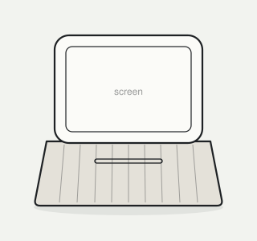
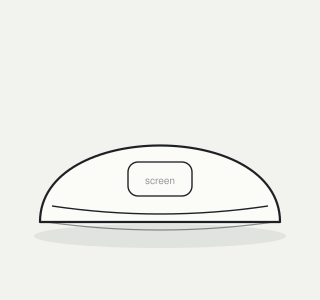

# VoiceIt

A rapid prototyping tool for products that listen and speak.

Smart speakers are the typical example: a small product on a table or a shelf that listens, answers, and often has a light and a small screen. Whether such a product works depends on timing, wording, voice and on who else is present. It might give useful advice but interrupt at the wrong moment, speak too formally, or address the wrong person. That is hard to judge on paper. VoiceIt plays such behaviour in the browser, with synthetic voices, screen content, light and sound, so that you can see and hear it.


*Smart speakers, one of them with a screen. Photo: Y2kcrazyjoker4, [CC BY-SA 4.0](https://creativecommons.org/licenses/by-sa/4.0/), via [Wikimedia Commons](https://commons.wikimedia.org/wiki/File:Google_Home_with_Home_Hub_and_Home_Mini_on_table.jpg).*

## How it works

A prototype has two parts:

- **Form**: an image of the product's proposed appearance, developed from a paper sketch with an image model. One image in `design/forms/`.
- **Behaviour**: what the product says and when, what it shows on its screen, and what its light and sounds do, in a scene with several people. Behaviours are written as scripts, one file each in `design/behaviours/`.

You work with three tools: your **AI agent** (Claude Code or Codex) writes and revises the scripts with you, an **image model** (ChatGPT or Gemini) renders your form sketches, and **VoiceIt** plays the result. Form, screen and light appear side by side, so any script can be played with any form.

A behaviour script reads like a screenplay. **Script excerpt**, from the example *Night light, night on ward 4*:

```
LIGHT: amber pulse dim
Eva's message arrives. The device makes no sound.
(pause 3)
Joost notices the light and turns his head.
JOOST (low): What is it?
SCREEN: word Eva
DEVICE (quietly): A message from Eva.
SCREEN: choice Eva's message | Show text | Later
TOUCH: Show text
```

Plain lines say what happens. A name in capitals speaks, with its manner in brackets; `DEVICE` is the product. `LIGHT`, `SCREEN` and `SOUND` are the product's light signals, screen content and sound effects; `TOUCH` is someone tapping the screen; `(pause 3)` is three seconds of silence. A complete script also starts with a few facts (the character's name, its voice, the people present); the full notation is in `system/SCREENPLAY.md`.

## Examples

The examples play as soon as VoiceIt is running: they are listed under *Examples*, below your own scripts, and their forms appear under the stage. They live in `examples/`.


*VoiceIt playing the Night light example with the lamp form. The numbered areas are explained in the [guide](GUIDE.md#the-screen).*

**Behaviour scripts**, in `examples/behaviours/`:

| File | Character | Scene |
| --- | --- | --- |
| `host - night on ward 4.md` | **Host**: talkative and helpful; says everything aloud | Night on ward 4: Joost lies awake after hip surgery, a message from his daughter arrives, and he wants to know whether he may take more pain relief. |
| `night light - night on ward 4.md` | **Night light**: few words, spoken quietly; works through its light and screen | The same night, the same people and events. |
| `night light - visiting hour.md` | **Night light** | Visiting hour on ward 4: the same character in another scene. |

Play the first two one after another to hear two characters in the same scene; play the second and third to see whether one character stays the same in two scenes.

**Forms**, in `examples/forms/`: simple line drawings (your own forms will be renders of your sketches).

 

*`bedside-unit.svg` and `lamp.svg`.*

To start from an example, ask your agent, for example: *"Copy the Night light example for night on ward 4."* The copy goes into `design/`, where you can change it; the examples themselves stay as they are.

**How to use VoiceIt:** the [guide](GUIDE.md) explains the screen, how to define a behaviour, and exactly what to say to your agent.

## What you need

To get and play VoiceIt:

- **Git**, to get VoiceIt from GitHub. Check with `git --version` in a terminal. On a Mac the first `git` command offers to install it; on Windows install [Git for Windows](https://git-scm.com/download/win).
- **Node.js 18 or newer**, to run VoiceIt: the LTS installer from [nodejs.org](https://nodejs.org). Check with `node --version`.
- A browser. VoiceIt has been tested in Chrome on a Mac; Edge, Safari and Firefox should work.

To make your own designs:

- The **Claude desktop app** (its **Code** tab) or the **Codex** app, signed in. The two look different, but both can read, write and check the scripts in your `voiceit` folder; this README and the guide call either one "your agent".
- **ChatGPT** or **Gemini**, for rendering form sketches (see `system/FORM.md`).

## Getting started

1. **Make a folder for your course work** on your laptop, for example `Documents/IDEM307`.
2. **Get VoiceIt from GitHub into that folder.** Open your agent with a new session on that folder (Claude: *Code* → new session → choose the folder; Codex: open the folder) and type:

   > Clone https://github.com/kortuem/voiceit.git into this folder.

   This makes a folder `voiceit` inside it. (In a terminal instead: go to the folder and type `git clone https://github.com/kortuem/voiceit.git`.)
3. **Start a new session on the `voiceit` folder itself.** This matters: in this folder the agent can read VoiceIt's instructions (`AGENTS.md`) and your design files. (Claude: *Code* → new session → choose `voiceit`; Codex: open `voiceit`.)
4. **Paste this as your first message:**

   > We are working with VoiceIt in this folder. Read AGENTS.md and follow it. Write every behaviour into design/behaviours/, and check every script after writing or changing it.

5. **Start VoiceIt.** Open a terminal in the `voiceit` folder and type:

   ```
   node system/bin/preview
   ```

   Your browser opens VoiceIt. Leave the terminal open while you work; `Ctrl+C` stops it.

   <details><summary>Opening a terminal in the <code>voiceit</code> folder</summary>

   - **Mac:** open Terminal, type `cd ` (with a space), drag the `voiceit` folder onto the window, press Return.
   - **Windows:** open the `voiceit` folder in File Explorer, click the address bar, type `cmd`, press Enter.

   </details>
6. **Play an example** (see [Examples](#examples)), then open VoiceIt's **Setup** tab and play the six voices.

## Working with VoiceIt

The [guide](GUIDE.md) has the details. In short:

- **Say how your product behaves.** *"New behaviour script: Rex, visiting hour. Confident, a know-it-all, speaks first, talks to Daan and the doctor rather than to Anna. Deep voice."* Your agent reads back what it understood; say **Go** and it writes the script.
- **Play it.** Within a few seconds the new script appears at the top of the list in VoiceIt. Click it, pick a form, press **Play**; press **Watch** to see it large.
- **Give notes.** *"Note on Rex: it talks too much when the doctor is there."* The agent revises the script.
- **Check.** After you edited a script yourself: *"Check our scripts."* The agent reports what the check finds, with line numbers, in plain words.

## Git while you work (optional)

**What Git is.** Git is a version control system: it keeps the history of a folder. You used it once already, to *clone* VoiceIt: that made a copy of the course's repository on your laptop, history included. From then on, the copy on your laptop is yours; Git works on it without a GitHub account.

**What a commit is.** A *commit* is a saved snapshot of the whole folder at one moment, with a short message saying what changed ("first version of Rex"). Commits let you go back to an earlier version, see what changed between two versions, and try something without losing what worked. *Pull* brings new commits from the course's repository into your copy (course updates); *push* sends your commits to a repository on GitHub (only needed to share with others, and needs an account).

You do not need any of this to use VoiceIt. Your agent can do each step for you when you ask:

- **Save a version:** *"Commit our work: first version of Rex."* The first time, Git asks for your name and e-mail.
- **See what changed:** *"What changed since our last commit?"*
- **Get course updates:** *"Pull the latest VoiceIt."* (In a terminal: `git pull --no-rebase`.) This brings in changes to `system/` and the brief. It usually goes smoothly as long as you have not changed `system/` or `examples/`.
- **Share with your group (needs a GitHub account):** fork the repository on GitHub, clone your fork, and push your commits there; teammates clone the same fork.

## Folders

- `system/` is the tool: notation, vocabulary, procedures, VoiceIt itself and its scripts. Do not edit it.
- `examples/` holds the example scripts and forms. Leave them as they are; to start from one, copy it into `design/` first.
- `design/` is yours: forms, behaviours and your notes.

## Without Node

Open `system/voiceit.html` in your browser (double-click it) and choose the `voiceit` folder with **Open folder** in the Setup tab. Scripts and forms play (tested in Chrome), but VoiceIt does not notice new files by itself (open the folder again after a change), and your agent cannot run the check.

## Licence

MIT (see `LICENSE`). Visual style after Vlak (vlak.dev) by Renn, Noord.
