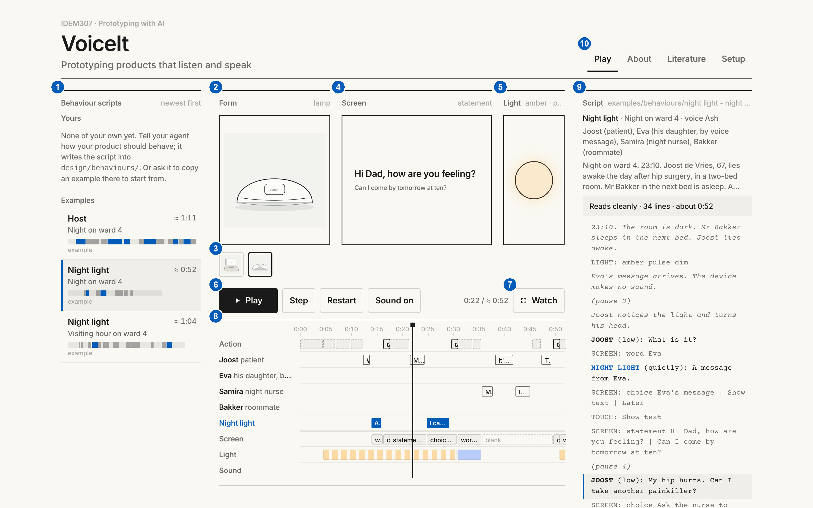

# VoiceIt tutorial

This tutorial takes you through one design session: from playing an example to a behaviour of your own, revised and paired with a product image. The [README](README.md) says what VoiceIt is for.

New to VoiceIt? [Watch the tour](media/voiceit-demo.mp4) first (1 min 26 s, with sound).

Quick reference: [what to say to your agent](#what-to-say-to-your-agent), [commands](#commands) for the terminal, and the script notation in [system/SCREENPLAY.md](system/SCREENPLAY.md).

## Words used here

| Term | Meaning |
| --- | --- |
| **Product** | What you design: a physical product that listens and speaks, such as a smart speaker. In the brief, a bedside smart speaker with a small screen and a light. |
| **Form** | An image of the product: a drawing or a render. One file in `design/forms/`. |
| **Behaviour script** | How the product behaves in one scene: who says what, when, and what the product shows, lights and sounds. One file in `design/behaviours/`. "Script" for short. |
| **Character** | Who the product is: what comes across when a form and a behaviour script are played together. A script names the character it explores (`character: Juno`); you judge the character. |
| **Agent** | Your AI coding assistant, Claude Code or Codex, in a session on your `voiceit` folder. It writes, revises and checks behaviour scripts with you. |
| **VoiceIt** | The page in your browser that plays behaviour scripts. |

## 1. Set up

You need the **Claude desktop app** (its **Code** tab) or the **Codex** app, signed in; **Git** (check with `git --version` in a terminal; on a Mac the first `git` command offers to install it, on Windows install [Git for Windows](https://git-scm.com/download/win)); and **Node.js 18 or newer** ([nodejs.org](https://nodejs.org), check with `node --version`).

1. **Make a folder for your course work**, for example `Documents/IDEM307`.
2. **Get VoiceIt into it.** Open your agent with a new session on that folder (Claude: *Code* → new session → choose the folder; Codex: open the folder) and type:

   > Clone https://github.com/kortuem/voiceit.git into this folder.

   A folder `voiceit` appears. (Already cloned it in a terminal, as in the README? Skip this step and open that folder in step 3.)
3. **Start a new session on the `voiceit` folder itself.** In this folder the agent can read VoiceIt's instructions (`AGENTS.md`) and your design files.
4. **Paste this as your first message**, and again at the start of every new session:

   > We are working with VoiceIt in this folder. Read AGENTS.md and follow it. Write every behaviour into design/behaviours/, and check every script after writing or changing it.

   The agent confirms that it has read the instructions.
5. **Start VoiceIt.** Open a terminal in the `voiceit` folder and type `node system/bin/preview`. Your browser opens VoiceIt. Leave the terminal open while you work; `Ctrl+C` stops it.

   <details><summary>Opening a terminal in the <code>voiceit</code> folder</summary>

   - **Mac:** open Terminal, type `cd ` (with a space), drag the `voiceit` folder onto the window, press Return.
   - **Windows:** open the `voiceit` folder in File Explorer, click the address bar, type `cmd`, press Enter.

   </details>
6. **Check the sound.** Open VoiceIt's **Setup** tab and press *Play the six voices*. You hear up to six voices (fewer different ones if your laptop has only a few), and the checks in the same tab all say *Yes*.
7. **Better voices (optional, takes a few minutes).** The standard voices sound robotic; better ones make the scripts much easier to judge. VoiceIt picks the best voices it finds by itself.
   - **Mac:** System Settings › Accessibility › Spoken Content › System voice › Manage Voices…. Under English, download a few voices marked **Premium** or **Enhanced**, for example Jamie, Daniel, Serena, Karen and Ava (low and high voices both help). Restart the browser, then play the six voices again.
   - **Windows:** use **Microsoft Edge**, which offers natural-sounding online voices (their names end in "Natural"). More voices can be added under Settings › Time & language › Speech › Manage voices; not every added voice is available to the browser. (Not yet tested on Windows.)

## 2. Play an example

The example scene: **night on ward 4**, 23:10. Joost, 67, lies awake the day after hip surgery. Mr Bakker, his roommate, is asleep in the next bed. A voice message arrives from Eva, Joost's daughter: can she visit tomorrow at ten? Joost is in pain and does not know whether he may take more pain relief. Samira, the night nurse, is on duty.

1. In the list on the left, under *Examples*, click **Night light · Night on ward 4**. Below the stage, click the lamp.
2. Press **Play**. The light pulses amber, without a sound. When Joost asks what it is, the screen shows *Eva* and the Night light says quietly: *"A message from Eva."* Joost taps *Show text*, and Eva's message appears on the screen. When he asks about a painkiller, it says it cannot advise and offers to call the nurse; while Samira is on her way, the light is dim blue.
3. Now click **Host · Night on ward 4** and press **Play**. Same scene, same people, other character: the Host reads everything aloud (*"Joost, you have a new voice message from Eva. I'll play it for you."*), next to a sleeping roommate.

Two characters in one scene: that contrast is what VoiceIt is for.

## 3. Inspect a conversation



1. **Behaviour scripts.** Your scripts, newest first, then the examples. Each row shows the character's name, the script's note, the approximate length, and the rhythm of the script (blue: the product speaks; grey: people speak).
2. **Form.** The product image currently shown.
3. **Form images.** All forms in `design/forms/` and the examples. Click one to show it with the selected script.
4. **Screen.** What the product shows on its screen at this moment.
5. **Light.** The product's light: its colour, and whether it pulses or is dimmed.
6. **Controls.** *Play* / *Pause*, *Step* (one line at a time), *Restart*, sound on and off, and the time.
7. **Watch.** Form, screen and light fill the window, for presenting. *Space* plays and pauses, the arrow keys step through the lines, *Escape* brings you back.
8. **Timeline.** The whole script over time: a lane for what happens, one lane per person, one for the product (blue), and lanes for screen, light and sound.
9. **Script.** The text of the script. The line being played is highlighted; problems are marked on their line.
10. **Tabs.** *Play*, *About* (background and the vocabulary), *Literature*, *Setup*.

Try it on the Night light:

- **Click the timeline** at about 0:22. The screen (4) shows Eva's message, and the script (9) highlights Joost's question about his hip.
- **Press Step** a few times. Each press plays one line and stops.
- **Click a line in the script**, for example *SAMIRA (quietly): Mr de Vries, you called?* Playback moves there.
- **Press Watch.** The stage fills the window, as you would show it to others.

## 4. Write a behaviour

The brief's scene: **visiting hour on ward 4**, 15:00. Anna Visser, 74, is recovering from pneumonia; Mrs de Wit in the other bed is trying to rest. Anna's son Daan and her granddaughter Lotte, 8, come to visit, and Lotte is curious about the speaker. Daan asks about Anna's blood test results, which Anna has not seen yet. Dr Okafor comes by on her round, and Anna wants to know when she can go home. When visiting time ends, Anna wants to be reminded of what the doctor said. (The full brief is in [BRIEF.md](BRIEF.md).)

Tell your agent how the product should behave in that scene. Start with **New behaviour script:**, then a name, the scene, and how it behaves. A useful description says:

- **who the product is**: a name, and its manner in a few words;
- **what it does at the key moments**: what it says or shows when something happens;
- **whom it addresses**, when several people are present;
- **what it says aloud and what it only shows** on the screen or with its light;
- **which voice**: low or high, calm or brisk.

Describe actions, not only adjectives. *"Friendly"* can be written in a hundred ways; *"greets Lotte by name and asks her what she is drawing"* is one. Three examples:

> New behaviour script: Juno, visiting hour. Warm and attentive, apologises a lot, talks mostly to Anna and is chatty with Lotte. Warm voice.

> New behaviour script: Pip, visiting hour. Discreet. When Daan asks about the blood results, it shows them on the screen for Anna only and says nothing aloud. It stays silent while the doctor talks. After the doctor leaves, it quietly offers Anna a written summary. Calm, mid voice.

> New behaviour script: Beacon, visiting hour. It communicates with its light: soft white when someone comes in, an amber pulse when there is news for Anna, off while the doctor is in the room. It speaks only once, at the end, to remind Anna of what the doctor said. Low voice.

What happens:

1. The agent **reads back** what it understood (name, what is going on, voice, key moments) and may ask one question. Nothing is written yet.
2. You answer, or say **Go**. The agent writes the script into `design/behaviours/`, checks it, and tells you how long it plays and which decisions it made itself.
3. Within a few seconds the script appears at the top of the list in VoiceIt, marked *just now*. You do not need to reload the page. Click it and press **Play**.

## 5. Review the script

The script column (9) shows the script as it plays. The file itself, which you can open in any text editor, begins like this (its first 18 lines):

```
---
character: Night light
note: Night on ward 4
voice: Ash
people: Joost (patient), Eva (his daughter, by voice message), Samira (night nurse), Bakker (roommate)
---
# Night on ward 4. 23:10. Joost de Vries, 67, lies awake the day after hip surgery, in a two-bed room.
# Mr Bakker in the next bed is asleep. A voice message from his daughter Eva arrives: can she visit tomorrow at ten?
# Joost is in pain and does not know whether he may take more pain relief. Samira, the night nurse, comes in.
# Joost wants to answer Eva before he sleeps.
23:10. The room is dark. Mr Bakker sleeps in the next bed. Joost lies awake.
LIGHT: amber pulse dim
Eva's message arrives. The device makes no sound.
(pause 3)
Joost notices the light and turns his head.
JOOST (low): What is it?
SCREEN: word Eva
DEVICE (quietly): A message from Eva.
```

The lines between `---` are facts: the character's name, its voice, a note of your own shown in the list, and the people present. The `#` lines are comments for the reader; they are not played. Then the script: what happens, who says what (the product speaks as `DEVICE`, or under its character's name), and what the product shows (`SCREEN`), lights (`LIGHT`) and sounds (`SOUND`). The notation is in [system/SCREENPLAY.md](system/SCREENPLAY.md); the screen components, light colours, sounds and voices are in [system/VOCABULARY.md](system/VOCABULARY.md) and in VoiceIt's About tab.

Read your script while it plays. Did the agent add anything you did not ask for? Its report names the decisions it made itself.

## 6. Revise the script

**Tell your agent what should change**, in your own words, and in which script:

> Juno talks over the doctor. It should wait until she has left.

The agent changes the script, checks it, and says what it changed. If your remark is about the character as a whole, it asks before changing the character's other scripts. The list shows the new version within a few seconds; play it again.

**Or edit the script yourself.** Open the file in `design/behaviours/` in any text editor, change a line and save. VoiceIt plays the new version within a few seconds. Then ask:

> Check our scripts.

The agent runs the check and explains what it finds, with line numbers, in plain words, and asks before fixing anything. Problems are also marked on their line in the script column (9).

## 7. Add a product image

A form can be a rough drawing or a rendered image (PNG, JPG, WebP or SVG). A way to develop one is in [system/FORM.md](system/FORM.md): sketch the product on paper, render the sketch with an image-generation tool such as ChatGPT or Gemini, mark up the render and render again.

1. Save the image in `design/forms/`, for example `design/forms/juno.png`. Keep sketches and earlier versions in `design/forms/process/`; VoiceIt shows only the images directly in `design/forms/`.
2. Within a few seconds the image appears among the form images (3).
3. Click it, and play your script with it. Then click the example forms: does the same behaviour feel different in another body?

## 8. Compare and judge

- **Fit:** does this behaviour suit this form? Play it with other forms.
- **Contrast:** play your scripts one after another, or compare their rhythm strips in the list.
- **Coherence:** if a character has several scripts, does it behave like the same character in each? Your agent can compare the scripts for you.
- **Details:** when does it speak first, and when does it wait? How much does it say? Whom does it address? What does it keep off the loudspeaker? How does it handle not knowing something?

## What to say to your agent

Four phrases cover the whole cycle. For everything else, say what you want in your own words.

| Say | When | What happens |
| --- | --- | --- |
| *We are working with VoiceIt in this folder. Read AGENTS.md and follow it. Write every behaviour into design/behaviours/, and check every script after writing or changing it.* | At the start of every session. | The agent reads VoiceIt's instructions and is ready. |
| **New behaviour script:** *name, scene. How it behaves.* | To make a new script, also for a character you already have, in another scene. | The agent reads back what it understood and waits. |
| **Go** | When the read-back is right. | The agent writes the script, checks it and reports. |
| **Check our scripts** | After you edited a script yourself, or when something does not play as expected. | The agent runs the check, explains what it finds with line numbers, and asks before fixing. |

To revise a script, just say what should change (step 6). The agent can also copy an example for you to start from, or compare a character's scripts, if you ask. Saving versions and course updates are under Git, below.

## Commands

Type these in a terminal in the `voiceit` folder. Your agent runs the same commands for you when you ask.

| Command | What it does |
| --- | --- |
| `node system/bin/preview` | Starts VoiceIt and opens it in your browser. Leave it running; `Ctrl+C` stops it. |
| `node system/bin/preview --port 4400` | The same, on another port, if the usual one is taken. |
| `node system/bin/check` | Checks every behaviour script in `design/behaviours/` and the examples. |
| `node system/bin/check "design/behaviours/juno - visiting hour.md"` | Checks one script. Keep the quotes: file names contain spaces. |
| `git pull --no-rebase` | Brings in a course update (see below). |

The check prints one line per problem: the file, the line number, *error* or *warning*, and what to do. For example, after a few hand edits:

```
design/behaviours/juno - visiting hour.md:1  error    The front matter has no voice.
design/behaviours/juno - visiting hour.md:7  error    “pink” is not a light colour. LIGHT needs a colour: white, amber, blue, green, red, violet, or off.
design/behaviours/juno - visiting hour.md:9  warning  “Juno:” looks like a speaker. Names are written in capitals; this line is read as an action.
design/behaviours/juno - visiting hour.md:12  error    “(pause 2,5)”: write the number with a point, not a comma: (pause 2.5). Not played.
design/behaviours/juno - visiting hour.md:13  error    “choise” is not a screen component. Use word, statement, choice, image or blank. Shown as a statement.
design/behaviours/juno - visiting hour.md:16  error    “ding” is not a sound. Use chime, alert or click.
design/behaviours/juno - visiting hour.md:17  warning  OKAFOR speaks but is not in the people line (Anna, Daan, Lotte).

Checked 1 behaviour: 5 errors, 2 warnings.
```

Errors stop a line from playing as written; fix them. Warnings are worth reading; they usually mean the script will not play as you intended. VoiceIt marks the same problems on their lines in the script column. The full list of what the check looks for is at the end of [system/SCREENPLAY.md](system/SCREENPLAY.md#what-the-check-looks-for).

## Saving versions with Git (optional)

**What Git is.** Git is a version control system: it keeps the history of a folder. You used it once already, to *clone* VoiceIt: that made a copy of the course's repository on your laptop, history included. The copy on your laptop is yours; Git works on it without a GitHub account.

**What a commit is.** A *commit* is a saved snapshot of the whole folder at one moment, with a short message saying what changed ("first version of Juno"). Commits let you go back to an earlier version, see what changed between two versions, and try something without losing what worked. *Pull* brings new commits from the course's repository into your copy (course updates); *push* sends your commits to a repository on GitHub (only needed to share with others, and needs an account).

You do not need any of this to use VoiceIt. Your agent can do each step for you when you ask:

- **Save a version:** *"Commit our work: first version of Juno."* The first time, Git asks for your name and e-mail.
- **See what changed:** *"What changed since our last commit?"*
- **Get course updates:** *"Pull the latest VoiceIt."* (In a terminal: `git pull --no-rebase`.) This brings in changes to `system/` and the brief. It usually goes smoothly as long as you have not changed `system/` or `examples/`.
- **Share with your group (needs a GitHub account):** fork the repository on GitHub, clone your fork, and push your commits there; teammates clone the same fork.

## When something does not work

- **A new script does not appear:** is VoiceIt still running in its terminal? Is the file in `design/behaviours/` (not somewhere else)? Ask the agent: *"Where did you save it?"*
- **A script does not play as expected:** *"Check our scripts."* Problems are also marked in the script column (9).
- **No sound:** is *Sound on* (6)? Test the voices in the Setup tab; voices differ between browsers and systems.
- **`node` is not found** right after installing Node.js: close the terminal and open a new one.
- **The agent does not seem to know VoiceIt:** is the session on the `voiceit` folder itself? Paste the starter message again.
